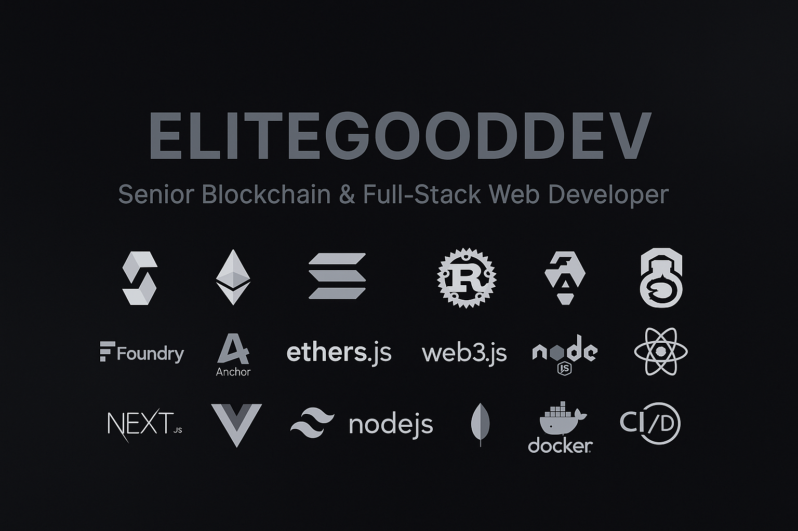

<!-- Hero banner -->

  

<h1 align="center">Hi, I'm EliteGoodDev 👋</h1>

  <b>Senior Blockchain, Web & Smart Contract Developer</b> 
  EVM • Solana • dApps • Full-stack Engineering

---

### 🧩 About Me

- Senior blockchain & web developer focused on **EVM + Solana** ecosystems
- Build end-to-end dApps: **smart contracts → backend → UI → deployment**
- Experienced in performance-oriented engineering, fast delivery, and scalable architecture

---

### 🛠 Tech Stack

#### 🔷 EVM / Ethereum

- **Solidity**, Hardhat, Foundry, Truffle
- ethers.js, web3.js, wagmi, viem
- OpenZeppelin, upgradeable contracts, proxy patterns
- DeFi, staking, vesting, presales, NFT pipelines

#### 🟣 Solana

- **Rust**, Anchor framework, Solana Program Library (SPL)
- Solana Web3.js SDK, wallet adapters
- On-chain programs (instructions, CPI, PDAs)
- Token programs, minting flows, metadata, on-chain verification

#### 🌐 Web & Backend

- **Frontend:** React, Next.js, Vue, Tailwind
- **Backend:** Node.js, Express, NestJS, Python (FastAPI)
- PostgreSQL, MongoDB, Redis
- REST / GraphQL APIs, WebSockets, Docker, CI/CD

---

### 🧱 What I Build

- DeFi systems (staking, farming, claim dashboards)
- Token presales & launchpads (EVM / Solana)
- NFT marketplaces, minting sites, metadata pipelines
- High-performance landing pages for crypto startups
- Full-stack dashboards & analytics apps

---

### 🤝 Let’s Build

Looking for someone who can ship **reliable, production-ready Web3 apps**  
(EVM or Solana)? Feel free to reach out.
